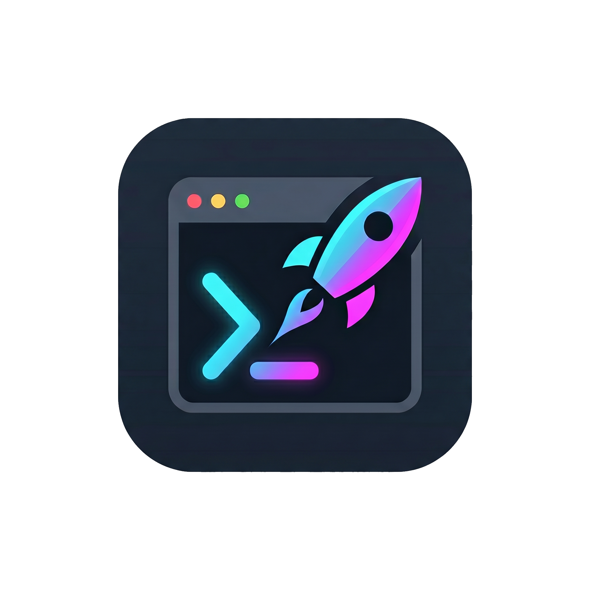

<div align="center">



# DevReady

### Set up any cloned project with a single command.

`git clone` → `cd project` → **`devready start`** → done.

[](https://github.com/ahmadkassem511/DevReady/actions/workflows/ci.yml)
[](LICENSE)
[](https://www.python.org/)
[](https://github.com/ahmadkassem511/DevReady)
[](https://github.com/ahmadkassem511/DevReady/issues)

Tested on **Windows, macOS, and Linux** (Python 3.9–3.12) on every commit.

</div>

---

## The problem

You clone a promising repo, and then the README marathon begins: install the
right Python or Node version, create a virtualenv, copy `.env.example`, install
system packages you've never heard of, start a database, run migrations, and
*finally* find the start command. Thirty minutes later you might have it
running — or you've given up.

**DevReady reads the project for you and does all of that automatically.**

## Two ways to use DevReady

DevReady comes in two flavours so it fits both audiences:

| | 🧑‍💻 **For developers (CLI)** | 🚀 **For everyone else (the app)** |
|---|---|---|
| **What it is** | The `devready` command in your terminal. | A point-and-click **app with a browser interface**. |
| **Install** | `pip install -e .` (one line). | Run **`install.sh`** / **`install.bat`** once. |
| **Daily use** | `devready start` / `devready run`. | Double-click the **DevReady** desktop icon. |
| **Picking a project** | You `git clone` it yourself. | **Browse a catalog**, search by category, click **Install**. |
| **Best for** | People comfortable in a terminal. | People who just want the app running — **no terminal knowledge needed**. |

Both run the *same* engine underneath. The easy app is just a friendlier front
door — see [For non-technical users](#for-non-technical-users--the-easy-app) and
[For developers](#installation-developers--cli).

## What it does

When you run `devready start` in a freshly cloned project, it walks through
nine steps:

| Step | What happens |
|------|--------------|
| 1. **Detect & plan** | Scans for `package.json`, `requirements.txt`, `pyproject.toml`, etc. to identify languages, frameworks, and required versions — then prints a **plan** showing what the project needs vs. what's installed, and what DevReady will set up, *before* it changes anything. (Run `devready doctor` any time to see this plan without starting.) |
| 2. **Read the README** | Uses a **free** LLM (via OpenRouter) — or an offline parser — to extract install commands, system packages, env vars, and DB steps. If the chosen free model is rate-limited or retired, DevReady automatically tries others and even queries OpenRouter's live model list to find a working free one. |
| 3. **Check compatibility** | Detects your hardware (CPU cores, RAM, free disk, GPU) and compares it against the requirements it read from the README. **Disk pre-flight:** it also estimates the install's footprint (per-stack baselines, a PyTorch-stack boost, Docker images) and fails a hopeless install at minute one — with cleanup advice — instead of dying mid-download at minute 25; a tight-but-plausible fit is a warning, not a block. A **truly required** but missing GPU (e.g. the project explicitly needs a CUDA-capable card) is flagged before you waste time installing; low RAM or few cores are shown as **warnings**, not blocks. CUDA is only treated as required on explicit phrasing — a passing mention of "tested on NVIDIA" or "CUDA optional" won't wrongly block a non-NVIDIA machine. In the GUI there's a **Check Hardware** button and a **Continue Anyway** option. |
| 4. **System packages** | Offers to install OS-level dependencies (ffmpeg, postgres…) via `brew`/`apt`/`winget`/`scoop`/`choco`, with your permission. Cleans up README-style names (`Node.js 18+` → `nodejs`) and skips language runtimes — those are handled per-project in step 5. Package-manager choice is **elevation-aware** (prefers no-admin managers like winget/scoop, and only uses choco when running elevated, so it never hangs on an admin prompt). |
| 5. **Setup** | **Uses the project's own setup method when it ships one** — `make setup`, `setup.sh`, `task setup`, or `just setup` — asking before it runs anything from the repo. **If a required tool or toolchain isn't installed, DevReady installs it for you and continues** — the runner (`make`/`just`/`task`), Node (via the package manager; `yarn`/`pnpm` provisioned through corepack), or a missing language toolchain (Rust, Go, Ruby, PHP, Java/Maven/Gradle, .NET) via `brew`/`apt`/`choco`/etc. Otherwise it does language-native setup: Python (correct version via [uv](https://github.com/astral-sh/uv) + isolated `.venv` + pip), Node (picks `npm`/`yarn`/`pnpm` from the lockfile), Rust (`cargo build`), Go (`go mod download`), Ruby (`bundle install`), PHP (`composer install`), Java (Maven/Gradle), .NET (`dotnet restore`). Git **submodules** are initialised, and **monorepos** are handled too — sub-projects in subdirectories (e.g. a `frontend/` Node app) are detected and set up as well, while **JS workspace members are never re-installed individually** (the root install already wired them). **Easiest-path installs:** when a project officially ships a prebuilt package (its own README documents `pip install <its-name>`) and building from source would mean compiling a bundled JS frontend, DevReady installs the **published wheel instead** — minutes instead of a 15+-minute source build — and skips the now-redundant frontend/sub-project builds (falling back to source automatically if the wheel fails). Long quiet steps print a **heartbeat** ("still working — 3 min elapsed…") so big builds never look frozen. When a step fails, the **self-healing loop** kicks in (see below). |
| 6. **Environment** | Generates a `.env` from `.env.example` + README hints, with safe random secrets for local dev. |
| 7. **Services** | If a `docker-compose.yml` exists, DevReady ensures a **container runtime** is available and starts the services — auto-selecting a Compose **profile** when every service is profile-gated. Engine handling is genuinely cross-platform: it finds and starts **Docker Desktop** (Windows/macOS) and waits patiently through its first boot, starts the daemon via systemd on Linux (never hanging on a sudo prompt), diagnoses the classic Linux *"permission denied on the Docker socket"* with the exact one-line `usermod` fix, and falls back to **Podman** (a no-admin engine) with a transparent `docker`→`podman` shim when Docker isn't an option. |
| 8. **Migrations** | Detects and runs migrations (Django, Alembic, Knex, Prisma, Rails, Laravel…) with the project's `.env` loaded. |
| 9. **Launch** | Runs the project's **documented** way to start — read from its own README — whether that's a framework command (Streamlit, Django, FastAPI, Flask, npm `dev`/`start`), a CLI the project just installed into its venv (e.g. `open-webui serve`), or a **`docker run` app** (launched with *every* documented flag, including `-e` credentials and ports, so logins work out of the box). It **waits until the server actually responds**, and keeps waiting while the app is visibly still working (first boots that download ML models or seed data get up to 10 minutes instead of a premature "not serving"). **Docker apps are managed as containers**: `stop` stops the container, `run` restarts it instantly with `docker start`, and `status` reports the container's real state. **Monorepos** start every component together. Projects needing a **one-time interactive setup** (onboarding/login) get the exact command to run surfaced prominently. For CLI/library/pipeline projects with no web server, a plain-language usage guide is shown instead. |

Every step is **non-destructive and asks before changing your system** where it
matters (use `--yes` to accept all prompts for unattended runs). DevReady is
**100% free for end users** — the optional AI uses a free model and requires no
credit card.

## How it works (under the hood)

DevReady is a pipeline of small, independent stages, so it's predictable and
easy to reason about:

1. **Detectors** look at the files in your project (`requirements.txt`,
   `package.json`, `go.mod`, `pom.xml`, `*.csproj`, …) and report each stack
   they recognise — its language, frameworks, required runtime version, and the
   files they matched. A polyglot repo (e.g. a Python API + a Node frontend)
   reports multiple stacks.
2. **The README parser** turns the project's prose README into structured setup
   data (install commands, system packages, env vars, DB steps). It prefers a
   free LLM via OpenRouter and falls back to a built-in offline regex parser, so
   it always works — even with no API key and no network.
3. **The engine** runs the nine steps in order, choosing the right action per
   stage: it prefers the project's *own* setup method (Makefile/Docker/scripts)
   when one exists, and otherwise runs the language-native setup, picking the
   correct runtime version **isolated per project** so nothing leaks between
   projects or onto your system.
4. **Launch** resolves a framework-appropriate start command, waits until the
   server actually accepts connections, and hands you the URL. For CLI/library
   projects with no server, it tells you how to run them instead.
5. **State** (the start command, port, and PID) is saved in
   `<project>/.devready/state.json`, which is what makes `devready run`,
   `status`, and `stop` instant afterwards.

Two rules hold everywhere: **all side effects go through one safe command
runner**, and **anything that changes your machine or runs repo-provided code
asks first** (unless you pass `--yes`).

## Self-healing & resilience

Real installs fail in messy ways. Instead of stopping at the first error,
DevReady tries to **diagnose and fix it, then continue** — the goal is to get
as many projects as possible all the way to a running state without you
touching the keyboard:

- **Deterministic retries first.** Common, well-understood failures are fixed
  offline with no AI call — e.g. routing a `pip`/`python` fix into the project's
  `.venv` interpreter (not your global Python), or resolving Windows `.cmd`/`.bat`
  shims and Git Bash (avoiding the `System32` WSL stub that breaks `bash`).
- **Resilient dependency installs.** If a single unbuildable package (say
  `flash-attn` or another GPU/CUDA-only wheel on a CPU machine) would otherwise
  fail an entire `requirements.txt`, DevReady drops just the offender and
  reinstalls the rest, so the project still comes up.
- **LLM-assisted healing as a fallback.** When deterministic fixes don't apply,
  DevReady can ask the free LLM for a structured fix, run it through a strict
  **allowlist/denylist safety check**, and retry the step. Destructive or
  out-of-scope commands are never executed.
- **Container runtime, automatically.** If a project needs Docker and it isn't
  installed, DevReady offers to install **Docker Desktop** (or fall back to
  **Podman**) and wires up a `docker`→`podman` shim so Compose still works. The
  GUI shows an **Install Docker** banner when a reboot/admin step is required.
  Once an engine is up, DevReady never launches a doomed docker command without
  it, and never keeps telling you to "install Docker" while your container is
  demonstrably serving.
- **The fastest correct install path.** When a project's own README documents an
  official prebuilt package, DevReady uses it instead of grinding through a
  heavy source build — and verifies installer claims instead of trusting exit
  codes (some package managers report success after installing nothing).
- **Deletes that actually delete.** Removing a project (CLI or GUI **Delete
  files**) clears Git's read-only object files that defeat a normal delete on
  Windows — no more leftover `.git` folders breaking the next install.
- **Honest about hard limits.** Some things can't be made zero-touch — a repo
  pinned to a deleted submodule commit, a GPU-only dependency on a CPU box, or
  Docker needing admin + reboot on Windows. DevReady does the maximum it safely
  can and then **tells you plainly** what's left and why (including the exact
  command to run when a one-time interactive step is genuinely yours to do).

## Installation (developers / CLI)

DevReady itself is a small Python package. **Requires Python ≥ 3.9.** Installing
it does **not** install your projects' dependencies — it installs the tool that
sets them up.

> 🚀 **Not a developer?** Skip this section — see
> [For non-technical users](#for-non-technical-users--the-easy-app) for the
> click-to-install app instead.

**From source (current recommended way):**

```bash
git clone https://github.com/ahmadkassem511/DevReady
cd DevReady
pip install -e .
```

The `-e` (editable) install means a `git pull` updates your installed tool
instantly — no reinstall needed. Add `".[dev]"` for the test tooling, or
`".[ui]"` if you also want the browser GUI (`devready ui`).

**Optional but recommended — set up the free AI parser during install:**

```bash
devready config set llm openrouter   # paste your free OpenRouter key (hidden)
```

This is optional (DevReady falls back to an offline parser), but it makes
reading messy READMEs noticeably more reliable. See
[Enabling the free AI parser](#enabling-the-free-ai-parser-optional-recommended)
for how to get a free key in three steps.

**Verify it installed:**

```bash
devready --version      # e.g. "DevReady 0.26.0"
devready doctor         # shows which toolchains DevReady can see
```

> **If `devready` isn't found**, the Python *Scripts* directory isn't on your
> `PATH`. Either add it (on Windows it's typically
> `C:\Users\<you>\AppData\Roaming\Python\Python3xx\Scripts`) and open a new
> terminal, or just use the identical `python -m devready ...` form everywhere.

> **Optional companion tools.** DevReady works without them, but installs more
> smoothly when present: [`uv`](https://github.com/astral-sh/uv) (auto-manages
> Python versions — DevReady installs this for you when needed),
> [`fnm`](https://github.com/Schniz/fnm) (Node versions), and `docker`. Run
> `devready doctor` to see what you have.

## Quick start

```bash
git clone https://github.com/some/project
cd project
devready start
```

That's it. DevReady prints a detection summary, walks the nine steps, and
launches the app.

## For non-technical users — the easy app

If you're not comfortable with a terminal, DevReady has a **click-to-install
app** with a friendly browser interface. You touch the terminal **once** (to
install); after that, everything is point-and-click.

### Install it (one time)

1. Download this repository (green **Code → Download ZIP** button) and unzip it.
2. Open the `scripts` folder and run the installer for your system:
   - **Windows:** double-click **`install.bat`**
   - **macOS / Linux:** open a terminal in that folder and run `sh install.sh`
3. That's the only terminal step. The installer sets everything up for you
   (it even installs Python behind the scenes via [`uv`](https://github.com/astral-sh/uv) —
   you don't need anything beforehand) and puts a **DevReady** icon on your
   desktop.

### Use it (every time after)

Double-click the **DevReady** icon. Your browser opens to the DevReady app,
where you can:

- **Browse projects by category** (AI, Web apps, Data & tools, Media, Dev tools,
  Games…), sorted by **GitHub stars**, or **search** across GitHub. Start from a
  hand-picked **Featured** set, then explore the most popular projects on GitHub
  — each shows its star count and a short description (tap **✨ Explain simply**
  for a plain-language version when you've added a free AI key).
- Click a project, read what it does, and press **Install** — DevReady clones
  it, sets everything up, and shows a **live progress log** right in the page.
- When it's ready, click **Open app** to launch it (e.g. `http://localhost:8501`).
- **First-run setup, guided.** Many apps (AI chat UIs especially) need *your*
  API key before they're useful. When DevReady detects that, it shows a
  **"Add your API key" form** right after install — with a link to the exact
  provider page where you create the key, a paste box, and a one-click
  **Restart to apply**. Keys are written only into that project's local
  `.env` and never leave your computer.
- **My Projects** is your control panel for everything you've installed: **Run**
  a project, **Open** it in the browser, **Stop** it, **Remove** it from the list,
  or **Delete** it — which really deletes: the whole folder (hidden files and
  packages included) *and* the Docker containers, volumes, and images the
  project created, so the disk space actually comes back. Projects still
  missing an API key show a **Finish setup** shortcut right on their card.
- **Settings → Free up disk space** reclaims the shared caches installs fill up
  (pip wheels, npm packages, the npx cache, cargo crates, Docker's unused data)
  with one click and tells you how much it freed. When free disk drops below
  5 GB, a **low-disk banner** appears at the top of the app with a one-click
  fix — before an install fails halfway.

### Adding the free AI key (optional, in the browser)

In the app, open **Settings**. There's a short built-in guide to get a **free**
OpenRouter key (about a minute, no credit card), and a box to paste it into.
Your key is stored **only on your computer** and is sent **only** to OpenRouter —
DevReady has no server and never sees it. It's optional: DevReady works without
it using an offline parser.

> 🔒 **Is this safe?** Yes — see [Security & privacy](#security--privacy). In
> short: the app runs only on your machine, vetted catalog apps are the default,
> and your API key never leaves your computer.

## Enabling the free AI parser (optional, recommended)

Real READMEs are messy prose. A small language model reads them far more
reliably than regex. DevReady uses [OpenRouter](https://openrouter.ai)'s **free**
tier so this costs you nothing.

**Get a free key in 3 steps (no credit card):**

1. Go to **<https://openrouter.ai/keys>**
2. Sign in and click **Create Key**.
3. Save it into DevReady:

   ```bash
   devready config set llm openrouter
   # You'll be prompted to paste your key (hidden input).
   ```

Want a different free model? Override it:

```bash
devready config set llm openrouter --model openai/gpt-oss-20b:free
```

> **You don't need to pick a model.** DevReady defaults to a working free model
> and, if it's ever retired or rate-limited, automatically falls back to other
> free models (ending with OpenRouter's `openrouter/free` auto-router). The
> `--model` flag is only there if you have a preference. Browse all free models
> at [openrouter.ai/models?max_price=0](https://openrouter.ai/models?max_price=0)
> — any id ending in `:free` works.

You can also set the key via an environment variable (handy for CI), which
takes precedence over the stored key:

```bash
export OPENROUTER_API_KEY="sk-or-..."
```

> **No key? No problem.** Without a key, DevReady automatically falls back to an
> offline regex parser. Everything still works — it's just a little less smart
> at reading unusual READMEs. Nothing is ever sent over the network in this mode.

## Commands

| Command | Description |
|---------|-------------|
| `devready start [path] [--yes]` | Run the full detect → set up → launch pipeline. **Use this the first time** (and after `git pull`). Add `--yes`/`-y` for an unattended run that accepts every prompt. |
| `devready run [path]` | **Relaunch a set-up project — fast.** Skips all setup and relaunches every saved component with the same documented commands (they survive `stop`). Docker apps restart via `docker start` — instant, no duplicate containers. |
| `devready ui [--no-browser]` | **Launch the browser GUI** — the easy, click-to-install app. Starts a local server (127.0.0.1 only) and opens it in your browser. Requires the `ui` extra (`pip install ".[ui]"`). |
| `devready list` | List every project DevReady has set up, with its run status and URLs. |
| `devready status [path]` | Show run state and URL(s) for each component — including the real state of app **containers** (works on the Podman fallback too). |
| `devready stop [path]` | Stop the launched server, any started services, and any app **containers** DevReady launched. |
| `devready clean [path]` | Remove DevReady-managed artifacts (`.venv`, state). |
| `devready cleanup [--deep]` | **Free disk space.** Purges the shared caches installs fill up (pip wheels, npm/yarn/pnpm, uv, Docker's unused data) and reports how much came back — safe, nothing installed breaks. `--deep` also removes all unused Docker images & volumes. |
| `devready doctor [path]` | Diagnose your toolchain and configuration — and, inside a project, show its **requirement plan**: what it needs vs. what's installed, and what DevReady will set up, *before* you run `start`. |
| `devready config show` | Print the current configuration (key masked). |
| `devready config set llm openrouter [--model M] [--api-key K]` | Configure the LLM. |
| `devready --version` | Print the version. |

`path` defaults to the current directory in every command.

### Typical workflow

```bash
git clone https://github.com/some/project && cd project
devready start     # first time: detect, install, configure, launch → opens the URL
# ...later, to run it again:
devready run       # instant relaunch, no re-setup
```

Because every project has its own `.venv`, Python version, and saved state, you
can `devready start` any number of projects and they never interfere — switch
between them with a plain `cd` and `devready run`.

> **`devready` vs `python -m devready`** — both work. After `pip install`, the
> `devready` command should be available directly. If your shell says
> "command not found", the Python *Scripts* directory isn't on your `PATH`; add
> it (e.g. `C:\Users\<you>\AppData\Roaming\Python\Python3xx\Scripts` on Windows),
> open a new terminal, or just keep using `python -m devready` — it's identical.

## Security & privacy

DevReady installs and runs real projects on your machine, and can hold an API
key, so it's built to be safe by default:

- **No cloud. Nothing phones home.** DevReady runs entirely on your computer.
  The browser GUI is served by a **local** server — there is no DevReady server
  anywhere, so there's no central place your data or keys could be collected.
- **Your API key stays on your machine.** It's stored in `~/.devready/config.json`
  with owner-only permissions (`0600`) and is sent **only** to OpenRouter, never
  to us. In the GUI it's entered over `localhost`, masked, and never logged.
- **The local web server is locked down.** It binds to **`127.0.0.1` only** (never
  reachable from your network), every action requires a **random per-launch
  token** embedded in the URL, and requests are checked for a loopback `Host`
  and same-origin `Origin`. Together these stop other programs or web pages on
  your machine from driving DevReady behind your back (CSRF / DNS-rebinding).
- **Vetted apps are the default.** In the easy app, non-technical users install
  from a **curated catalog** of reviewed projects — not the open internet.
  Installing an arbitrary GitHub URL is a separate, clearly-warned "advanced"
  action, because it runs that project's own setup on your computer.
- **Nothing changes your system silently.** System-level installs ask first
  (unless you pass `--yes`), each project is isolated in its own environment,
  and before any install the app shows you exactly what it will do.

> ⚠️ **Honest note:** running any project's setup means running *its* code. The
> curated catalog exists precisely so non-technical users don't have to judge
> that risk themselves. Only use the "install from URL" option for repos you
> trust.

## How configuration is stored

DevReady keeps a small config file at `~/.devready/config.json`:

```json
{
  "llm": {
    "provider": "openrouter",
    "api_key": "sk-or-...",
    "model": "openai/gpt-oss-20b:free"
  }
}
```

The file is written with owner-only permissions (`0600`) because it can hold an
API key. Per-project runtime state (the launched server's PID, etc.) lives in
`<project>/.devready/state.json` and is ignored by git.

## Supported stacks (today)

- **Python** — `requirements.txt`, `pyproject.toml`, `setup.py`; version via
  `.python-version`/`requires-python`; frameworks: Django, Flask, FastAPI,
  Celery, Streamlit.
- **Node.js** — `package.json`; version via `.nvmrc`/`engines.node`;
  frameworks: Next.js, React, Vue, Angular, Express, NestJS, Svelte.
- **Rust** — `Cargo.toml`; builds with `cargo build`, runs with `cargo run`;
  frameworks: Actix Web, Rocket, Axum, Warp.
- **Go** — `go.mod`; deps via `go mod download`, runs `go run .`; frameworks:
  Gin, Echo, Fiber, chi, Gorilla.
- **Ruby** — `Gemfile`; deps via `bundle install`; Rails (`rails server`,
  `db:migrate`) and Sinatra.
- **PHP** — `composer.json`; deps via `composer install`; Laravel
  (`artisan serve`, `artisan migrate`) and Symfony/Slim.
- **Java** — `pom.xml` (Maven) / `build.gradle` (Gradle), wrapper-aware; Spring
  Boot (`spring-boot:run` / `bootRun`), Quarkus, Micronaut.
- **.NET** — `*.csproj` / `*.sln`; deps via `dotnet restore`, runs `dotnet run`;
  ASP.NET Core (port read from `launchSettings.json`).

Plus any project that ships its own setup (`make`/`task`/`just`/`setup.sh`) or a
`docker-compose.yml` — DevReady uses those directly.

Adding a new stack is intentionally easy — see
[Contributing](#contributing--architecture).

## Per-project isolation (no version conflicts)

DevReady never changes your system Python or affects other projects. Each
project gets **two layers of isolation**:

- **Its own `.venv`** — so package versions in project A can't clash with
  project B.
- **The Python version it actually needs** — if a project requires Python 3.11
  but you're on 3.14, DevReady reuses an installed 3.11 if you have one, and
  otherwise downloads it with [uv](https://github.com/astral-sh/uv) into uv's
  private cache (no admin rights, no `PATH` changes, no impact on anything
  else). It then builds that project's `.venv` from the right interpreter — and
  recreates a mismatched `.venv` automatically.

So you can have a 3.9 project, a 3.11 project, and a 3.12 project side by side,
and `devready start` does the right thing for each without you managing
versions by hand.

## Contributing & architecture

DevReady is built to be edited. The codebase is small and each module has a
single, clear job:

```
devready/
├── cli.py                 # Thin Typer CLI — parses args, delegates to Engine.
├── engine.py              # Orchestrates the nine-step pipeline + run/status/stop/clean/doctor.
├── config.py              # Read/write ~/.devready/config.json (the only place that does).
├── utils.py               # Shared console, safe subprocess runner, OS/package-manager detection.
├── detectors/             # "What is this project?"
│   ├── base.py            #   Detector base class + DetectionResult.
│   ├── python.py          #   Python detector.
│   ├── node.py            #   Node detector.
│   ├── rust.py            #   Rust (Cargo) detector.
│   ├── go.py              #   Go (go.mod) detector.
│   ├── ruby.py            #   Ruby (Gemfile) detector.
│   ├── php.py             #   PHP (composer.json) detector.
│   ├── java.py            #   Java (Maven/Gradle) detector.
│   ├── dotnet.py          #   .NET (csproj/sln) detector.
│   └── __init__.py        #   Registry + detect_stack() entry point.
├── environment/           # "How do we set it up?"
│   ├── strategies.py      #   Detect the project's OWN setup method (make/task/just/script).
│   ├── system_deps.py     #   Install OS packages + container runtime (Docker/Podman), elevation-aware.
│   ├── system_check.py    #   Pre-install hardware compatibility check (CPU/RAM/disk/GPU vs README).
│   ├── services.py        #   Detect & provision backing services (DBs, etc.) via containers.
│   ├── version_manager.py #   Resolve per-project Python version (reuse or uv), create venvs, run installs.
│   └── env_vars.py        #   Generate a .env with safe dev defaults.
├── ai/
│   ├── client.py          #   Thin OpenRouter client (free-model fallback + JSON asks).
│   ├── guide.py           #   Per-project run guidance (how to use a non-web/CLI project).
│   ├── healer.py          #   Self-healing install loop: deterministic retries + safe LLM fixes.
│   └── readme_parser.py   # LLM (OpenRouter) + offline regex fallback. Same output shape.
└── web/                   # The optional browser GUI ("devready ui").
    ├── server.py          #   FastAPI app + security middleware (token/host/origin).
    ├── security.py        #   Token generation + loopback/origin checks.
    ├── catalog.py         #   Load/search the curated catalog (the safe surface).
    ├── catalog.json       #   The vetted project list shown in the GUI.
    ├── jobs.py            #   Clone + run setup in the background, stream the log.
    └── static/index.html  #   The single-page app (browse, install, library, settings).
scripts/                   # install.sh / install.bat — the one-time easy-app installer.
tests/                     # pytest suite (no network needed).
```

**Design principles, so a teammate can pick this up cold:**

- **The CLI is dumb on purpose.** All behaviour lives in `engine.py` and the
  feature modules, so it's easy to unit-test without spawning a process.
- **One door to each side effect.** All shelling-out goes through
  `utils.run_command`; all config I/O goes through `config.Config`. Change the
  implementation once, everywhere benefits.
- **Detectors are pluggable.** To add a stack: create `detectors/<lang>.py`,
  subclass `Detector`, implement `detect()`, and register it in
  `detectors/__init__.py::ALL_DETECTORS`.
- **Two parser strategies, one result.** `ai/readme_parser.py` returns the same
  `ReadmeInsights` whether it used the LLM or regex, so callers never branch.
- **Never surprise the user.** System-changing steps prompt for confirmation,
  and `.env`/source files are never overwritten without an explicit flag.

### Running the tests

```bash
pip install -e ".[dev]"
pytest
```

The suite uses temp directories and stubs out the network, so it runs fast and
offline.

## Roadmap

- **Easy app, next steps:** signed installers (so non-technical users don't see
  "unknown publisher" warnings), in-GUI GitHub search ("advanced" mode), and an
  optional sandbox for installing untrusted repos.
- Per-project *version* pinning for more runtimes (Go, Ruby, Java) the way uv
  handles Python and fnm/corepack now handle Node — DevReady already
  auto-installs the toolchains themselves and honours pinned Node + pnpm/yarn
  versions; this extends exact-version pinning to the remaining languages.
- Richer migration detection — Django, Alembic, Knex, **Prisma**, Rails, and
  Laravel are supported today; next up: TypeORM, Flyway, EF Core.

## License

Licensed under the **Apache License 2.0** — see [LICENSE](LICENSE) and
[NOTICE](NOTICE). You're free to use, modify, and distribute this software,
including commercially, provided you preserve the license and notices.
